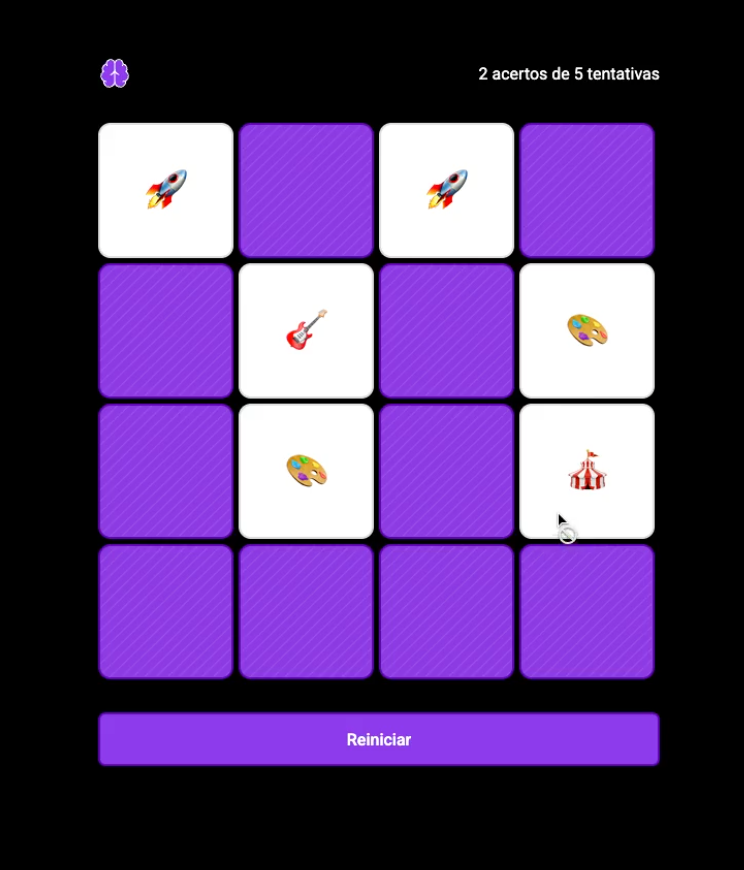

# 🧠 Jogo da Memória

Um **Jogo da Memória interativo** desenvolvido utilizando apenas **HTML, CSS e JavaScript puro (Vanilla JS)**.  
O projeto tem como objetivo exercitar **lógica, manipulação do DOM e interatividade no navegador**, sem uso de frameworks.

A aplicação foi publicada utilizando **GitHub Pages**, permitindo que qualquer pessoa jogue diretamente pelo navegador.

---

## 🚀 Demonstração

🔗 **Acesse o jogo online:**  
https://github.com/daiannystorch/MemoryGameProject

---

## 🎮 Como Jogar

1. Clique em uma carta para revelá-la.
2. Escolha uma segunda carta.
3. Se as cartas forem iguais, elas permanecem abertas.
4. Se forem diferentes, elas viram novamente.
5. O objetivo é **encontrar todos os pares no menor número de tentativas possível**.

---

## 🛠️ Tecnologias Utilizadas

- **HTML5** — Estrutura da aplicação  
- **CSS3** — Estilização e layout do jogo  
- **JavaScript (Vanilla JS)** — Lógica do jogo e manipulação do DOM  
- **GitHub Pages** — Hospedagem do projeto

---

## 📂 Estrutura do Projeto
memory-game/
│
├── index.html
├── styles.css
├── scripts.js
│
├── assets/

---

## ⚙️ Funcionalidades

- Embaralhamento automático das cartas
- Sistema de comparação de pares
- Feedback visual para acertos e erros
- Interface simples e intuitiva
- Jogo totalmente executado no navegador

---

## 🌐 Deploy

O projeto está publicado usando **GitHub Pages**.

---

## 💡 Possíveis Melhorias

- Contador de movimentos
- Cronômetro de tempo
- Sistema de pontuação
- Diferentes níveis de dificuldade
- Animações mais avançadas
- Versão mobile otimizada

---

## 👨‍💻 Autora

Desenvolvido por **Daianny Storch**

- GitHub: https://github.com/daiannystorch
- LinkedIn: https://www.linkedin.com/in/daianny-storch/

---

⭐ Se você gostou do projeto, considere dar uma **estrela no repositório**!

